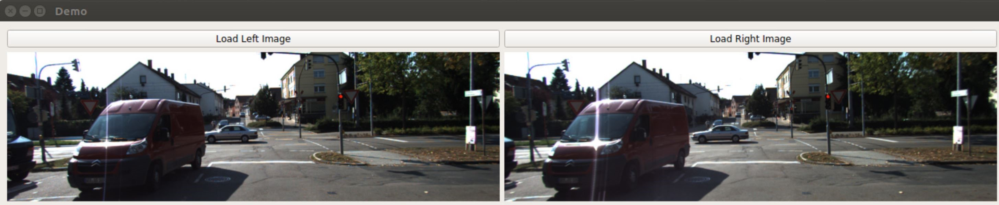
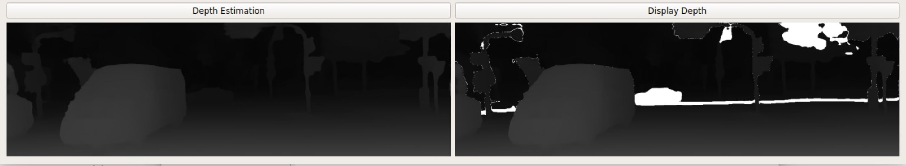

# Stereo-Depth-Estimation-Network(sdenet)

**Contributors**
- Chengqian Ma
- Bingkun Li
- Robert Chang
----------------------------------


## Background

Depth estimation based on stereo cameras has been a research topic for a long time. Since depth estimation from stereo images is essential to computer vision applications, including autonomous driving for vehicles, 3D model reconstruction, and object detection and recognition.

Traditional method uses disparity between stereo camera images to calculate the depth, but it has problems in calculating the disparity map especially in the matching part of potential features.

With the fast development of deep learning, people can do a better job in feature matching by using Convolutional Neural Network. We want to use deep-learning method to achieve the depth estimation based on stereo cameras.


## Organization of the project

The package is organized as the following structure:

    sdenet(final)
    /--- sdenet/
        /--- models/
            /--- __init__.py
            /--- basic.py
            /--- stackhourglass.py
            /--- submodule.py
        /--- sample_image/
        /--- tests/
            /--- config.py
            /--- test_all.sh
            /--- test_generate_depth_file.py
            /--- test_generate_disparity_image.py
            /--- test_generate_specific_depth_area.py
        /--- trained/
            /--- KITTI2015.tar
            /--- sceneflow.tar
        /--- utils/
            /--- SdenetDemo.py            
            /--- __init__.py
            /--- config.py
            /--- display_depth.py
            /--- generate_depth_file.py
            /--- generate_disparity_image.py
            /--- generate_specific_depth_area.py
            /--- inference.py
            /--- preprocess.py
        /--- __init__.py
    /--- doc/
        /--- CSE583_Final_Presentation.pdf
        /--- Component_Specification.md
        /--- Functional_Specification.md
    /--- .gitignore
    /--- .travis.yml
    /--- LICENSE.txt
    /--- README.md
    /--- requirements.txt
    /--- setup.py


## Data sources

- KITTI 2015: a real-world dataset with street views from a driving car. It contains 200 training stereo image pairs with sparse ground-truth disparities obtained using LiDAR and another 200 testing image pairs without ground-truth disparities. Image size is H = 376 and W = 1240.
http://www.cvlibs.net/datasets/kitti/

- Scene Flow: a large scale synthetic dataset containing 35454 training and 4370 testing images with H = 540 and W = 960. This dataset provides dense and elaborate disparity maps as ground truth.
https://lmb.informatik.uni-freiburg.de/resources/datasets/SceneFlowDatasets.en.html


## Installation
***Please install and run in Linux.***

#### Step 1: Install Stereo-Depth-Estimation-Network by cloning it on you computer with `git` command:

```
git clone https://github.com/chengqianma/sdenet.git
```

#### Step 2: Create the environment and install the package you need with the command:

```
cd sdenet/
conda create --name [environment name] python=2.7
conda install PyQt5
python setup.py install
```

#### Step 3: Check the dependencies to run `Stereo-Depth-Estimation-Network` are completely installed on your computer by running the command:

```
pip install -r requirements.txt
```

Now, you are ready to run `sdenet` on  your computer. 


## Tutorial: how to use

#### APIs
- `generate_depth_file(path_left, path_right, baseline, focal, pixel_size)`
    
    Takes the paramters of path of left image, right image and camera parameters--baseline, focal and pixel_size. Returns a matrix of depth(Unit: m) in a `.pickle` file.
    
- `generate_disparity_image(path_left, path_right)` 
    
    Takes in the path of left and right image and returns a disparity image as a `.png` file. 

- `generate_specific_depth_area(path_left, path_right, depth, baseline, focal, pixel_size)`
    
    Takes the path of left and right image, depth(Unit: m) and camera parameters--baseline, focal and pixel_size.. Returns a list of coordinates(x, y) of pixels on the depth image. 

#### Depth Estimation Demo
The Demo is located at `(Your Path)/sdenet/sdenet/utils`. Enter the following command to launch after finishing installation:

```
cd sdenet/utils
python SdenetDemo.py
```

Click "Load Left Image" and "Load Right Image" to load the image pair. 

----

----

Click "Depth Estimation" to run the model and get the depth image. Click "Display Depth" to highlight the area in a certain distance.

----

----

Notice: Default camera parameters are only set for KITTI 2015. Before running the model, make sure that those parameters in `config.py` are correctly matched if another dataset applies. Or, you can set new parameters while invoking APIs. 
